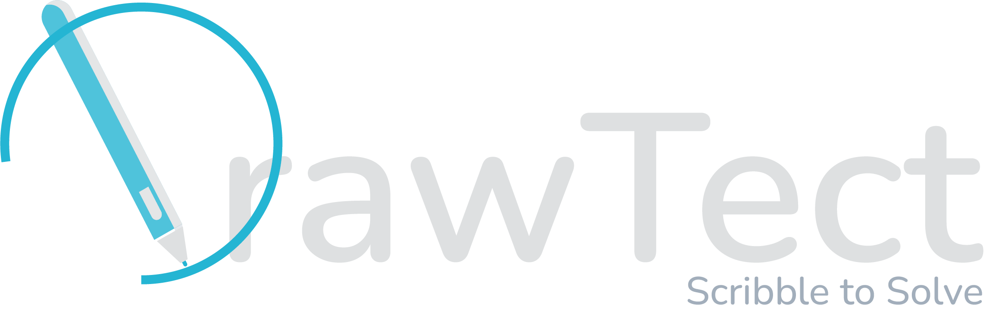
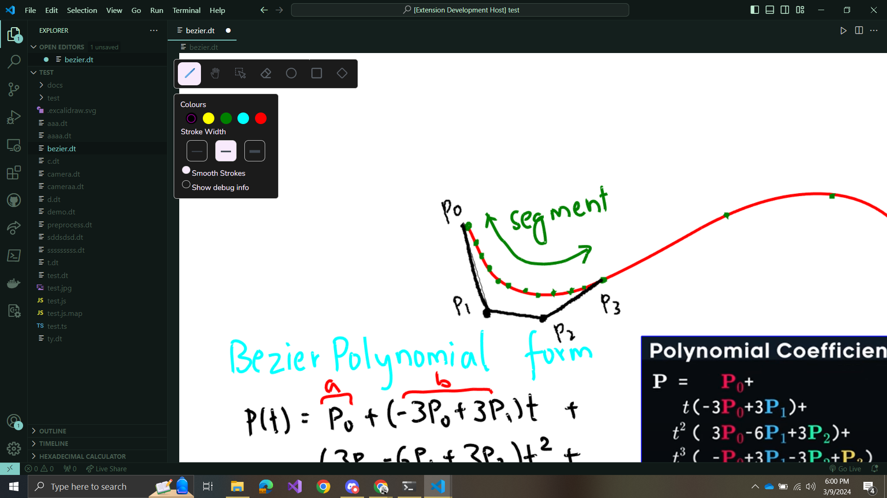
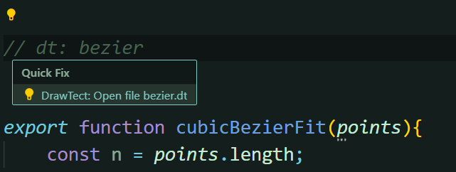
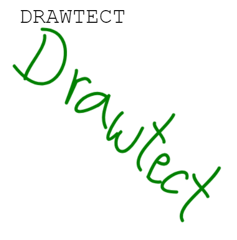
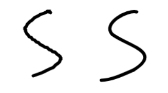

# DrawTect: Scribble to Solve

DrawTect is an extension to Visual Studio Code, which adds drawing support to the editor, allowing users to create diagrams/small notes that could aid in better understanding and visualization of the concepts being implemented. The extension also allows users to insert these notes/ pictures within their code, grouping the code and the notes relating to it in the same place.  
This is especially useful in areas where comments might not be sufficient such as computer graphics, game development, and so on. It also provides a conversion from handwritten notes to text using a simple HCR model trained on EMNIST handwritten alphabet dataset. This model uses Convolutional Neural Network (CNN) architecture to train and recognize the handwritten characters present in the VSCode interface.

## Installation
Get it from the [Marketplace](https://marketplace.visualstudio.com/items?itemName=Dots.drawtect)  

Or 

1. Clone the repository.
2. Create a workspace in VSCode.
3. Run the extension.

## Project Screenshots

  
  

 

    <!--  -->
    

## Features

- **Whiteboard Application:** Includes drawing tools, panning, and shapes.
- **Smooth Strokes:** Utilizes cubic Bezier splines for smooth stroke rendering.
- **Quick Access:** Allows easy access to whiteboard files from source files via comments.
<!-- - **Handwritten Character Recognition:** Converts handwritten characters to digital text. -->

## License

This project is licensed under the [MIT License](./LICENSE.md).

## Code of Conduct

Please review our [Code of Conduct](./CODE_OF_CONDUCT.md) before contributing.

## Contributing

Read the [Contribution Guidelines](./CONTRIBUTING.md) before making any contributions.

## 
Developed by Team Dots [2024]